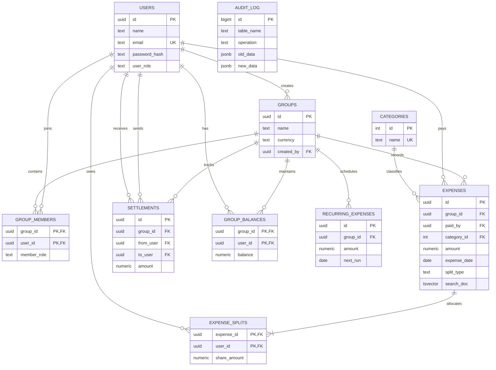

# Entity relationship diagram

```mermaid
erDiagram
    USERS ||--o{ GROUPS : creates
    USERS ||--o{ GROUP_MEMBERS : joins
    GROUPS ||--o{ GROUP_MEMBERS : contains
    GROUPS ||--o{ EXPENSES : records
    USERS ||--o{ EXPENSES : pays
    EXPENSES ||--|{ EXPENSE_SPLITS : allocates
    USERS ||--o{ EXPENSE_SPLITS : owes
    GROUPS ||--o{ SETTLEMENTS : tracks
    USERS ||--o{ SETTLEMENTS : sends
    USERS ||--o{ SETTLEMENTS : receives
    CATEGORIES ||--o{ EXPENSES : classifies
    GROUPS ||--o{ GROUP_BALANCES : maintains
    USERS ||--o{ GROUP_BALANCES : has
    GROUPS ||--o{ RECURRING_EXPENSES : schedules

    USERS {
        uuid id PK
        text name
        text email UK
        text password_hash
        text user_role
    }
    GROUPS {
        uuid id PK
        text name
        text currency
        uuid created_by FK
    }
    GROUP_MEMBERS {
        uuid group_id PK, FK
        uuid user_id PK, FK
        text member_role
    }
    EXPENSES {
        uuid id PK
        uuid group_id FK
        uuid paid_by FK
        int category_id FK
        numeric amount
        date expense_date
        text split_type
        tsvector search_doc
    }
    EXPENSE_SPLITS {
        uuid expense_id PK, FK
        uuid user_id PK, FK
        numeric share_amount
    }
    SETTLEMENTS {
        uuid id PK
        uuid group_id FK
        uuid from_user FK
        uuid to_user FK
        numeric amount
    }
    CATEGORIES {
        int id PK
        text name UK
    }
    AUDIT_LOG {
        bigint id PK
        text table_name
        text operation
        jsonb old_data
        jsonb new_data
    }
    GROUP_BALANCES {
        uuid group_id PK, FK
        uuid user_id PK, FK
        numeric balance
    }
    RECURRING_EXPENSES {
        uuid id PK
        uuid group_id FK
        numeric amount
        date next_run
    }
```